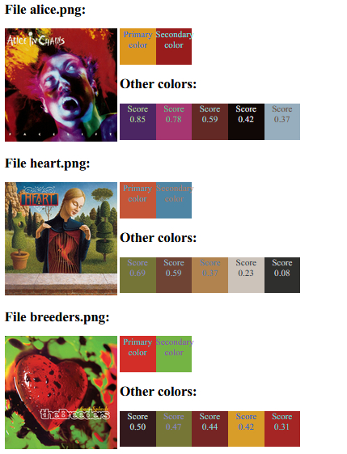

# PHP Dominant Color library

This library extracts dominant colors from images - those, which are most likely to attract the viewer's eyes. 



The library uses [K-means clustering](https://en.wikipedia.org/wiki/K-means_clustering) method to group image pixels into different *color bins*. Those colors are then evaluated by their saturation and differences between others. Two of them are picked as *trully dominant* (primary and secondary).


## Usage

We want to find dominant colors with three additional colors from image ```heart.png```.
```PHP
$imageSrc = "heart.png";
$totalNumberOfColors = 5; // primary + secondary + 3 additional

$colorInfo = Naomai\DominantColor::fromFile($imageSrc, $totalNumberOfColors);
```
Number of colors is the number of *color bins*, it also should include primary and secondary colors.

The result is an array of following structure:
```PHP
$colorInfo = [
	'primary' => 0xDEFDEF, 
	'secondary' => 0xABCABC,
	'palette' => [
		0 => ['color' => 0xABCABC, 'score' => 0.8],
		/// etc
	]
```
All colors are formatted as standard RGB integer in form: ```0xRRGGBB```. 
```palette``` contains additional colors. The ```score``` field is a score from secondary color choosing algorithm. The chosen secondary color has value of ```1.0```.

See **examples** directory for a visual demonstration.

This project relies on the elegant [PHP K-Means](https://github.com/bdelespierre/php-kmeans/) library by Benjamin Delespierre.